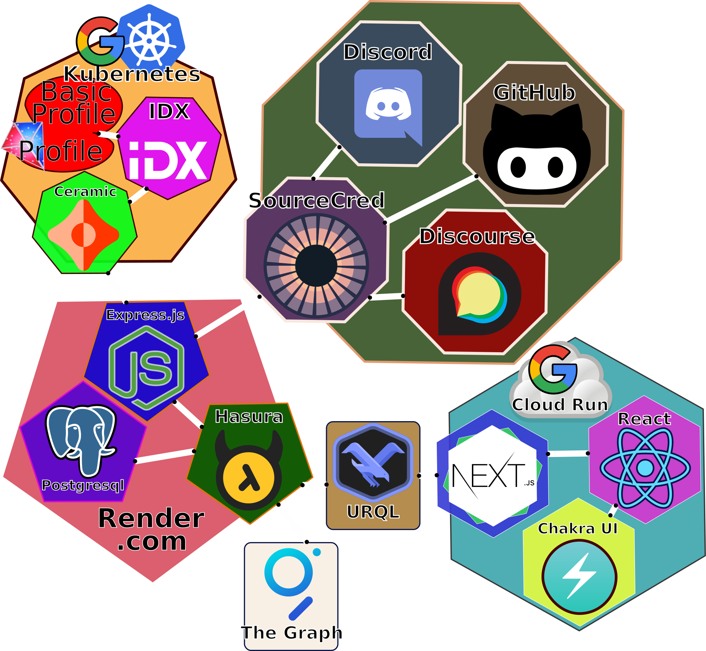

# The Game

Monorepo for the MetaGame applications, backend and databases.

We're using the following stack:



#### Frontend

- [NextJS](https://nextjs.org/)
- [Chakra UI](https://chakra-ui.com/)

#### Backend

- [Hasura](https://hasura.io/)
- [GraphQL](https://graphql.org/)
- [URQL](https://formidable.com/open-source/urql/)
- [Ceramic IDX](https://idx.xyz/)
- [Infura](https://infura.io/)
- [Docker](https://www.docker.com/)

#### Overall

- [Prettier](https://prettier.io/)
- [Lerna](https://lerna.js.org)
- [TypeScript](https://www.typescriptlang.org/)
- [Javascript](https://developer.mozilla.org/en-US/docs/Web/JavaScript)

## MetaGame

- [Website](https://metagame.wtf)
- [Wiki](https://wiki.metagame.wtf)
- [Notion](https://www.notion.so/Welcome-to-MetaGame-7e28e75f3c264c7b939eaaa2239b9c28)

## Guides

If you're new to the MetaGame codebase, check out the following guides to learn how to contribute.

- [Video Walkthrough](https://www.youtube.com/watch?v=-Qhz6H4t0Ik)
- [Backend Guide](guides/BACKEND.md)
- [Frontend Guide](guides/FRONTEND.md)
- [C4 Guide](guides/C4.md)
- [Contributing Guide](guides/CONTRIBUTING.md)

## Development

Before you start contributing read the [Contributing Guide](guides/CONTRIBUTING.md)!

### Bootstrap

Create your local .env file

```shell script
cp .env.sample .env
```

Create a GitHub token at https://github.com/settings/tokens

Set `GITHUB_API_TOKEN=your_github_token` in `.env`

### Install Packages

```shell script
yarn
```

Initial TS Compilation For Monorepo Packages

```shell script
yarn typecheck
```

Adding a package to the codebase can be done with [Lerna](https://github.com/lerna/lerna/tree/main/commands/add#readme)

### Run services

**Start backend services**

```shell script
yarn docker:start
```

**For M1 Mac Users**

Official docker images of Hasura don't work on M1 yet

In `hasura/Dockerfile`
Replace

```
FROM hasura/graphql-engine:v1.3.3.cli-migrations-v2
```

with

```
FROM fedormelexin/graphql-engine-arm64:v1.3.3.cli-migrations-v2
```

- Runs docker containers for backend, Hasura Engine, and PostGres database
- will auto-restart on any changes to `packages/backend` and `packages/utils`

If you are running for the first time on an empty database, once the services
are running you have two options to populate the database:

1. Populate the database with the production dataset:

```shell script
yarn hasura:seed-db
```

2. Populate the database with the initial dataset:

```shell script
curl -X POST http://localhost:4000/actions/syncSourceCredAccounts?force=true
```

**Rebuild backend services**

If your docker containers fail to start due to changes in config, you may need to rebuild the containers. This can take several minutes.

```shell script
yarn docker:build
```

**Stop backend services**

```shell script
yarn docker:stop
```

- Stops all the containers

**Troubleshooting**

Rebuild and run the containers (in attach mode):

```shell script
docker-compose up --build
```

In case non of the above commands are working try purge the docker containers and images you can do this by running (notice: this removes all the containers and images on your computer!):

```shell script
docker system prune -a
```

_If you're working on the front-end and the build fails with something like the error below, you'll need to create a `.env` file in `packages/web` and add `NEXT_PUBLIC_GRAPHQL_URL=https://api-staging.metagame.wtf/v1/graphql`_

```
[Error [CombinedError]: [Network] request to http://localhost:8080/v1/graphql failed, reason: connect ECONNREFUSED 127.0.0.1:8080] {
  type: 'CombinedError',
  graphQLErrors: [],
  networkError: {
    message: 'request to http://localhost:8080/v1/graphql failed, reason: connect ECONNREFUSED 127.0.0.1:8080',
    type: 'system',
    errno: 'ECONNREFUSED',
    code: 'ECONNREFUSED'
  }
}
```

** A note about environment variables **

If you need to add an environment variable, it will need to go in several places:

- your own `.env` file
- `.env.sample`
- `gcp-deploy.yaml`
  - For backend variables, add to the `deploy-backend` step alongside the others
  - For frontend variables, add to the `deploy-frontend` step. **You may also need to add it to the `build-frontend` step, if it is used in a page that is statically generated by next.js**
- `gcp-deploy-frontend.yaml` for frontend variables, this should be the same as the frontend actions in the other yaml file

Secrets will need to be added to the `TheGame` Github secrets; contact a senior builder for assistance.

As an aside, the `gcp-deploy-frontend.yaml` is the deployment configuration for our test and production frontend instances, while `gcp-deploy.yaml` is only for PR environments.

### Run NextJS Web App dev mode (new)

```shell script
yarn web:dev
```

Go to [http://localhost:3000](http://localhost:3000)

Happy Coding!

### Run Discord Bot

```shell script
yarn discord-bot dev
```

This will automatically register with Discord and relay chat messages to your local instance! Pretty cool. Testing in a dedicated test Discord server (rather than MetaGame's) is recommended.

### Tooling

Start Hasura console

```shell script
yarn hasura:console
```

Hasura CLI example

```shell script
yarn hasura migrate status
yarn hasura migrate squash --name "<feature-name>" --from 1598417879553
yarn hasura migrate apply --version "<squash-migration-version>" --skip-execution
```

[Hasura CLI documentation](https://hasura.io/docs/1.0/graphql/manual/hasura-cli/index.html)
[Hasura Migrations Guide](https://hasura.io/docs/1.0/graphql/manual/migrations/basics.html#migrations-basics)

Generate GraphQL Types

```shell script
yarn generate
```

Reload Schema + Generate GraphQL Types (backend needs to be running)

```shell script
yarn update-schema
yarn generate
```

### Restart with fresh database

```shell script
yarn docker:clean
yarn docker:start
```

### Run typechecks

```shell script
yarn typecheck
```

### WIP Branch Push

Upon pushing to the repository a linting check will be initialized validating your code.
If you want to push the branch to the repository (maybe for collaboration) while the code isn't completely valid yet you have the option of skipping the linting process:

```shell script
git push -u origin <branch> [--no-verify]
```

Please use this only when absolutely necessary!

### Debugging with Visual Studio Code

When running the backend stack locally using docker-compose, you can still debug the backend container using VS Code. Just add [this configuration](https://gist.github.com/alalonde/75e4d4237aacd9e45ac38e5b5faf479b) to your `.vscode/launch.json`.
